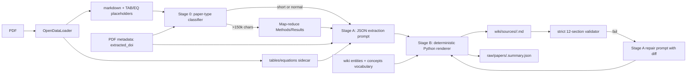

# Ingestion Prompt Architecture

A one-page reference for how a PDF turns into an Obsidian-flavoured wiki
summary in `research-wiki/`. The full implementation plan is at
[ingestion_prompt_overhaul_plan.md](ingestion_prompt_overhaul_plan.md);
this doc just shows the wiring.

## High-level data flow

## Module responsibilities

| Module                      | Responsibility                                                                        |
| --------------------------- | ------------------------------------------------------------------------------------- |
| `prompts.py`                | **Single source of truth.** Section contract, frontmatter schema, prompt builders, JSON schemas, chunker. No I/O, no LLM. |
| `validation.py`             | `SummaryValidator` (0–100 score), `REQUIRED_HEADERS` (sourced from `prompts`).         |
| `genai_client.py`           | Vertex/Gemini client + rate limiting. Two validators: lenient 5-section (legacy on-disk corpus) and `validate_structured_summary_strict` (12-section anchored, used by live pipeline). |
| `paper_classifier.py`       | Two-tier classifier — cheap regex heuristic on first 3000 chars → optional LLM fallback. |
| `wiki_vocabulary.py`        | mtime-cached alias index over `wiki/entities/` + `wiki/concepts/`. `find_canonical(term)` and `top_k_candidates(text, k=50)`. |
| `renderer.py`               | Stage B. Pure-Python deterministic renderer of Stage A JSON → final Markdown. Wikilink canonicalisation, evidence-quote footnotes, frontmatter null handling, format_version stamp. |
| `pdf_extractor.py`          | Pipeline orchestrator. Branches on `USE_TWO_STAGE_EXTRACTION`. Loads sidecar JSON, detects truncation, calls Stage A + Stage B (or legacy path), runs strict validator, repairs on miss. |
| `benchmarks/score.py`       | Deterministic A/B scoring (no LLM). `score_summary`, `compare_summaries`, `acceptance_check` for flag-flip decisions. |

## Key invariants

1. **The 12-section contract lives only in `prompts.REQUIRED_SECTIONS`.**
   `validation.REQUIRED_HEADERS` and
   `genai_client.validate_structured_summary*` source from it.
2. **The strict validator on the live path uses anchored regexes**
   (`^##\s+<name>\s*$`). It refuses numbered, bolded, or
   missing-space headings. The lenient validator stays for old
   on-disk summaries.
3. **`extracted_doi` is authoritative** when present. The model is told
   to copy it verbatim. When absent, the model emits JSON `null` (no
   inventing).
4. **Wikilinks resolve through `wiki_vocabulary`.** When a slug exists,
   `[[TaPHS1]]` becomes `[[taphs1|TaPHS1]]`. When it doesn't, the
   display is left as-is and recorded in
   `RenderResult.new_candidates` for the entity-creation pipeline.
5. **Evidence footnotes are validated against the source.** A bullet
   with an `evidence_quote` that doesn't substring-match the
   normalised source has its footnote dropped (and a warning logged) —
   the bullet still renders without an anchor.
6. **`format_version` frontmatter key is emitted on every render.**
   Bump `prompts.FORMAT_VERSION` when changing the contract so
   downstream tools can distinguish output formats.

## Feature flag

`config.USE_TWO_STAGE_EXTRACTION` — `False` by default.

* `False` → legacy single-call Markdown path (still benefits from
  Tasks 1–6: strict validator, DOI injection, placeholder-scaffold
  removal, table/equation/truncation prompt blocks, max_retries fix).
* `True` → Stage A (JSON) + Stage B (renderer) path. Persists JSON
  sidecar at `raw/papers/<paper>.summary.json`. Falls back to legacy
  path on Stage A failure.

The flag flip should follow an A/B benchmark using
`benchmarks/score.py`. Acceptance gate: avg score regress < −5,
canonicalised_rate regress < −0.05, wikilink_count regress < −2.

## Performance budgets (from the plan)

| Dimension                   | Today           | Cap                              |
| --------------------------- | --------------- | -------------------------------- |
| LLM calls / typical paper   | 1 (legacy)      | ≤ 3 (classifier+main+repair)     |
| LLM calls / long paper      | 1 (legacy)      | ≤ `2 + ⌈len(text)/30 000⌉`       |
| `top_k_candidates` per paper| n/a             | ≤ 250 ms (≤ 1 ms cached)         |
| `wiki_vocabulary` cold build| n/a             | ≤ 5 s (1.6 s on 9557 entries)    |

## Where to look first

* "What's the summary contract?" → `prompts.REQUIRED_SECTIONS`
* "What does the LLM see?" → `prompts.build_main_prompt` /
  `prompts.build_stage_a_prompt`
* "How are wikilinks resolved?" → `wiki_vocabulary.find_canonical` +
  `renderer._canonicalise_wikilinks`
* "What does the orchestrator do?" →
  `pdf_extractor._generate_and_validate_summary` and the
  `_generate_via_two_stage` helper alongside it.
