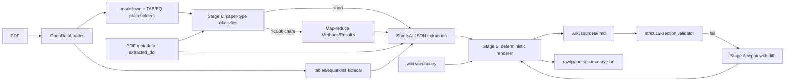

# Research Wiki Ingestion Prompt Overhaul — Implementation Plan

> **Status:** in progress (Task 1 + Task 2.5 land first).
> **Code-reviewed:** corrections folded in below — see *Review fixes* at the end of every section.

## Problem statement

The single LLM call that converts raw OpenDataLoader markdown into a 12-section
Obsidian-flavoured wiki summary (in `research-wiki/pdf_extractor.py::generate_paper_summary` +
`repair_paper_summary`) suffers from a cluster of defects that compound to produce
inconsistent, unverifiable, and weakly-linked summaries:

- The strict 12-section prompt is contradicted by a permissive 5-section validator
  in `genai_client.validate_structured_summary`, so 7/12 sections are never enforced
  and the repair pass rarely fires for them.
- **`_generate_and_validate_summary` has a `max_retries = 1` off-by-one bug.** With
  `range(max_retries)` the loop yields only `attempt = 0`, so the `else` branch that
  calls `repair_paper_summary` is unreachable. **The repair pass never runs in
  production today.** (Confirmed at `pdf_extractor.py:911`.)
- The verified DOI extracted from PDF metadata is plumbed to `generate_paper_summary`
  as a parameter but never injected into the main prompt body — the model has to
  guess. (`repair_paper_summary` *does* prefix `doi_context` already; we will mirror
  that wording in the main prompt.)
- Frontmatter values are scaffolded with literal placeholders the model echoes
  verbatim or approximately when the source is sparse:
  `tags: [comma, separated, tags]`, `doi: "10.xxxx/xxxxx"`, `authors: "Last1 et al."`,
  `journal: "Journal Name"`, `source_count: 1`. (Confirmed in
  `pdf_extractor.py:638-646`.)
- A 150 000-char silent tail-truncation drops Discussion/References for long
  reviews without telling the model. (Confirmed in `_truncate_for_context` at
  `pdf_extractor.py:614`.)
- The pipeline already produces `{{TAB_n_paper}}` and `{{EQ_n_paper}}` placeholders
  in the markdown plus a sidecar JSON of tables/equations
  (`post_process_extracted_artifacts` at line 375) — but the prompt never tells
  the model what they mean, so they're either ignored or paraphrased incorrectly.
- 8534 entities and 1584 concept pages already exist in `wiki/entities/` and
  `wiki/concepts/`, but the prompt has no controlled vocabulary, so wikilinks
  fragment (e.g., `[[Cas9]]` vs `[[SpCas9]]`, `[[CRISPR/Cas]]` vs `[[CRISPR/Cas9]]`
  vs `[[CRISPR]]` are all minted without canonicalisation).
- All paper types (primary research, methods, review, perspective, correction
  notice) get the same 12-section scaffold. The
  `li_2025_correction_heat_shock.md` example is a 2-page errata where 3/12
  sections (Methods, Mechanistic Insights, Future Directions) become
  `Not reported in this paper.` (the original "9/12 empty" claim was wrong —
  the model actually filled 9/12 with reasonable correction-notice prose;
  the structural problem is real but milder than first stated).
- Generic per-section guidance ignores high-value domain extractables (QTL
  coordinates, LOD scores, gRNA targets, effect sizes, cultivar names, p-values,
  sample sizes).
- Zero-hallucination is asserted but not auditable — no evidence anchors, no
  source spans.

The duplicated 12-heading list across two prompts in `pdf_extractor.py` and a
third copy in `validation.py::REQUIRED_HEADERS` means the contract drifts
whenever any one is touched.

## Requirements

R1 — **Faithfulness.** Hallucinated DOIs, authors, journals, and gene names
must drop sharply. Every non-trivial claim should be traceable to the source.

R2 — **Structural reliability.** Every paper produces a parseable, fully-populated
12-section document that passes a strict validator on the first try in the
common case, and on a single repair pass otherwise. *(Requires fixing the
`max_retries` off-by-one — Task 2.5.)*

R3 — **Single source of truth.** The 12-section contract, frontmatter schema,
and per-section rules live in exactly one place (`research-wiki/prompts.py`).

R4 — **Verified DOI usage.** The `extracted_doi` from PDF metadata is injected
into the main prompt body and treated as authoritative.

R5 — **Frontmatter discipline.** No placeholder leakage. Every key has either a
real value or an explicit null (or `Not reported in this paper.` for prose
fields).

R6 — **Wikilink canonicalisation.** When an entity or concept matches an
existing wiki page (case-insensitive, alias-aware), the canonical slug is used.

R7 — **Placeholder awareness.** The prompt explicitly tells the model what
`{{TAB_n_paper}}` and `{{EQ_n_paper}}` markers mean and instructs it to
reference them by ID rather than describe their contents.

R8 — **Paper-type aware structure.** A lightweight classifier
(correction notice / primary research / review / methods / perspective) gates
section depth so a 2-page errata doesn't get a 12-section scaffold.

R9 — **Domain-specific extraction.** Methods/Results/Entities sections include
explicit extraction targets for wheat-genetics + CRISPR (QTL names + chromosome
arms + LOD scores, gRNA sequences, cultivar/germplasm names, effect sizes with
units, p-values, sample sizes).

R10 — **Evidence anchors.** Each major claim in Key Results is followed by a
footnote-style source anchor — a verbatim quote span ≤ 25 words from the
source. Quote validation normalises Unicode punctuation and soft hyphens before
substring matching. Coverage target: ≥ 60 % of bullets carry verifiable
footnotes (the original 80 % target was tightened down to be realistic on
OCR'd text).

R11 — **Long-paper handling.** Papers > 150 k chars use hierarchical
summarisation (chunked Methods/Results passes that feed the final prompt)
instead of silent tail-truncation.

R12 — **Backwards compatibility.** Existing summaries on disk continue to
validate against the lenient validator. New summaries pass the strict validator.

R13 — **Test-driven, incremental.** Each change ships behind a feature flag
with golden-file tests and a measurable improvement on a held-out sample of
existing summaries.

## Verified findings (with file:line refs)

- `pdf_extractor.py::generate_paper_summary` lines 629–723 — main prompt.
  `repair_paper_summary` lines 725–763 — fallback. Both duplicate the
  12-heading list as inline strings.
- `pdf_extractor.py::_generate_and_validate_summary` lines 902–956. **Bug:
  `max_retries = 1` at line 911 means `range(1)` only yields `attempt = 0`,
  so the `else` repair branch never executes.**
- `validation.py::REQUIRED_HEADERS` line 7 (12 entries) and
  `validation.py::SummaryValidator` line 30 — separate, stricter validator
  not currently called from the live pipeline.
- `genai_client.py::validate_structured_summary` line 314 — checks only 5
  sections.
- `pdf_extractor.py::post_process_extracted_artifacts` line 375 — produces
  the `{{TAB_<n>_<paper>}}` / `{{EQ_<n>_<paper>}}` placeholders plus a slim
  sidecar JSON `{paper, tables: [...], equations: [...]}` at
  `raw/papers/<paper>_data_objects.json`.
- `config.py::AI_MODEL = "gemini-3.5-flash"` does **not** match the
  `_KNOWN_GEMINI_PREFIXES` allowlist (`gemini-1.5-`, `gemini-2.0-`,
  `gemini-2.5-`) at `pdf_extractor.py:76-96`. Out of scope for prompt
  redesign — the startup validator just warns.
- `wiki/entities/` has 8534 entries, `wiki/concepts/` has 1584. Slugified
  filenames (`cas9.md`, `crispr-cas9.md`, `phenylpropanoid-pathway.md`).
- Real failure mode confirmed: `franke_2001_modified_lignin_tobacco.md` is
  1.45 KB of `Not reported in this paper.` because the OpenDataLoader
  fallback gave us only Wiley download-notice text (the raw markdown is
  3.7 KB of repeated download-banner spam).
- Real failure mode confirmed: `li_2025_correction_heat_shock.md` is a
  correction notice forced into the 12-section scaffold; 3/12 sections
  (Methods, Mechanistic Insights, Future Directions) are
  `Not reported in this paper.`. The remaining 9 are filled with reasonable
  prose — the structural defect is the wasted scaffold, not 9 empty slots.
- Counterexample (good output):
  `aslam_2026_crispr_mediated_engineering.md` — rich and densely
  wikilinked. That's the bar.

## Architectural shifts

1. **Single source of truth.** Move the 12-heading contract, frontmatter
   schema, per-section rules, and section validators into a new module
   `research-wiki/prompts.py` (constants + builders). Both
   `generate_paper_summary` and `repair_paper_summary` consume from it;
   `validation.py` and `genai_client.validate_structured_summary` validate
   against it.
2. **Two-stage extraction (Stage A: JSON, Stage B: render).** Stage A asks
   the model for a typed JSON payload (metadata, entities, methods,
   `results_with_anchors`, references, etc.) against an explicit schema.
   Stage B is a deterministic Python renderer that turns that JSON into the
   markdown with frontmatter, wikilinks (canonicalised against the wiki
   vocabulary), placeholder references, and source anchors. The JSON is
   also persisted as a sidecar (`raw/papers/<paper>.summary.json`) so
   search/RAG can index it without re-parsing markdown.
3. **Paper-type aware + length-aware orchestration.** A lightweight
   pre-classifier picks paper type (correction / primary / review / methods
   / perspective) and chooses an appropriate scaffold variant (the
   correction-notice variant has 4 sections, not 12). Long papers
   (> 150 k chars after OpenDataLoader) use map-reduce over Methods/Results
   before the final synthesis call.

### Performance and cost budgets

| Dimension                    | Today           | After Tasks 5+7+10                | Cap                         |
| ---------------------------- | --------------- | --------------------------------- | --------------------------- |
| LLM calls / paper (typical)  | 1               | 1 (classifier) + 1 (Stage A) ≈ 2  | ≤ 3 (classifier+main+repair) |
| LLM calls / paper (long)     | 1               | 1 + ⌈N/30 k⌉ chunks + 1 + ≤ 1     | ≤ `2 + ⌈len(text)/30 000⌉`  |
| Vocabulary lookup / paper    | n/a             | < 50 ms (sorted prefix index)     | ≤ 250 ms                    |
| Wiki-vocabulary build (cold) | n/a             | one-time ~1 s (mtime-cached)      | ≤ 5 s                       |
| Cheap heuristic classifier   | n/a             | regex on first 3 k chars          | < 5 ms                      |

These are tracked metrics in the Task 11 A/B benchmark report. **The flag
flips only if no metric regresses by > 5 points and total LLM-call delta is
acceptable** (target ≤ 2× legacy on the typical-paper class).

## High-level data flow

## Tasks

### Task 1 — Single source of truth + golden corpus baseline

- Create `research-wiki/prompts.py` with `REQUIRED_SECTIONS` (ordered list of
  dicts: `{name, max_words, required, rules}`), `FRONTMATTER_KEYS` (typed
  schema), `PAPER_TYPES` (enum-like), and helpers (`required_headers`,
  `lenient_required_headers`, `lint_summary`, `format_required_headings_block`).
- Refactor `validation.py::REQUIRED_HEADERS` and
  `genai_client.validate_structured_summary` to import from `prompts.py`.
- Keep `validate_structured_summary`'s public signature and return shape
  unchanged so the orchestrator keeps working.
- Add `tests/test_prompts_contract.py` asserting the 12 headings round-trip
  through both validators in the right order.
- Add `tests/golden/` snapshots of 5 representative existing summaries
  (`aslam_2026_*` strong; `franke_2001_*` metadata-only; `li_2025_*`
  correction; `bi_2014_*` and `liton_2020_*` typical primary) and
  `tests/test_baseline.py` that prints a per-summary score table.

### Task 2 — Tighten the validator + repair the regex contradiction

- Replace the 5-section validator in
  `genai_client.py::validate_structured_summary` with a strict 12-section
  check using anchored regexes (`^##\s*<heading>\s*$`).
- Enforce: (a) YAML frontmatter is present and parseable, (b) every required
  frontmatter key is present, (c) at least 3 wikilinks exist.
- Keep the relaxed regex as `validate_structured_summary_lenient` for
  backwards compatibility on the existing corpus.
- Wire `_generate_and_validate_summary` to call the strict version on new
  outputs but the lenient one on already-on-disk re-validations.

### Task 2.5 — Fix the `max_retries=1` off-by-one bug *(BLOCKING for R2)*

- Change `max_retries = 1` to `max_retries = 2` (or refactor the loop) at
  `pdf_extractor.py:911` so the `else: structured_summary = self.repair_paper_summary(...)`
  branch is reachable.
- Add a unit test using a stub generator that returns an incomplete summary
  on the first call and a complete one on the repair call; assert the
  validator passes after exactly 2 calls.
- This is a five-line change and is the smallest unblocker for the plan's
  "first-try, single-repair-otherwise" target in R2.

### Task 3 — Inject verified DOI + remove placeholder scaffolds

- Make `generate_paper_summary` use `extracted_doi` (already a parameter,
  currently ignored). Mirror the `doi_context` wording already used in
  `repair_paper_summary` for consistency.
- Replace `tags: [comma, separated, tags]`, `doi: "10.xxxx/xxxxx"`, etc.
  with explicit instructions to emit `null` when unknown. The renderer
  introduced in Task 7 maps `null` to display strings.
- Build the prompt from
  `prompts.build_main_prompt(paper_type, extracted_doi, candidate_tags, candidate_wikilinks)`.

### Task 4 — Wiki vocabulary index for wikilink canonicalisation

- Add `research-wiki/wiki_vocabulary.py` walking `wiki/entities/*.md` and
  `wiki/concepts/*.md` once per process, building an in-memory dict of
  `{normalized_term: canonical_slug}`.
- **Use a sorted prefix index / Aho-Corasick automaton, not naive
  per-entity substring scans.** With 8534+ entities, naive scan is O(n·m)
  per paper; a token-based scan over the source text is O(m).
- Provide `find_canonical(term: str) -> str | None` and
  `top_k_candidates(text: str, k=50) -> list[str]`.
- mtime-based caching: rebuild only when an entity/concept page is newer
  than the cached index.
- Performance budget: cold build ≤ 5 s; per-paper lookup ≤ 250 ms.

### Task 5 — Lightweight paper-type pre-classifier

- **Cheap heuristic first:** regex on first 3 000 chars of source. If the
  text starts with `Correction to:`, `Erratum`, `Editorial`, `In response
  to`, or matches a short-page-count + correction-vocabulary signature,
  classify directly without LLM.
- LLM fallback only when the heuristic is ambiguous. Use
  `get_ai_response(..., temperature=0, model=config.FILTER_MODEL)` with a
  strict "respond with only one word" prompt.
- On parse failure, default to `primary_research` (least-disruptive).
- Note: today `FILTER_MODEL == AI_MODEL == "gemini-3.5-flash"` so there's
  no per-call cost saving from `FILTER_MODEL`. The cheap-heuristic-first
  pattern is what saves cost, not the model choice.
- Store the classification in `pipeline_logger`.

### Task 6 — Placeholder awareness + truncation transparency

- Read the slim sidecar JSON at prompt-build time.
- Build a brief table-of-tables block: "This paper has N tables. Reference
  them by their `{{TAB_n_<paper>}}` ID, do not transcribe their full
  contents into prose."
- **Cap the captions list at 20 items** to keep context under control;
  for longer papers append "…and M more (see sidecar)".
- Compute `len(full_raw_text) > 150_000` *before* truncation and pass the
  boolean to the prompt builder, which appends an explicit warning.

### Task 7 — Two-stage extraction (Stage A JSON + Stage B renderer)

- Stage A: strict JSON schema in `prompts.py` covering frontmatter fields,
  paper type, per-section content, entities (`{text, canonical_candidate}`),
  key results (`{claim, evidence_quote, source_locator}`), references.
- Use `response_mime_type='application/json'` if the GenAI client supports
  it; otherwise instruction-only JSON with parse + repair loop.
- Persist the JSON to `raw/papers/<paper>.summary.json` (note:
  *not* `<paper>.json`, which is the OpenDataLoader sidecar — different
  filename suffix to avoid collision).
- Stage B is a pure Python renderer (no I/O, no LLM); test it heavily.
- Behind `config.USE_TWO_STAGE_EXTRACTION = False` initially.

### Task 8 — Paper-type-aware section scaffolds + domain-specific extraction

- `prompts.sections_for(paper_type)` returns the variant.
  - **Correction notice:** 4 sections (Title & Metadata, Correction Summary,
    Original Citation, Limitations & Caveats).
  - **Review:** 12 sections, but Methods & Experimental Design becomes
    Reviewed Literature & Inclusion Criteria.
  - **Primary research:** 12 sections + `<extract_targets>` block:
    QTL nomenclature (`Qphs.<lab>-<chrom>`), LOD/R², gRNA targets, cultivar
    names, p-values, sample sizes, statistical methods.
- Update the strict validator to look up the variant by paper type — but
  only when `USE_TWO_STAGE_EXTRACTION` is on, so old summaries keep
  validating against the 12-section default.

### Task 9 — Evidence anchors as Markdown footnotes

- Stage A produces an `evidence_quote` (≤ 25 words, verbatim from source)
  and an optional `source_locator` per Key Results bullet.
- Stage B renders these as Markdown footnotes appended to the bullet.
- **Quote validation normalises:** Unicode punctuation (smart quotes →
  straight, em/en dashes → `-`), soft hyphens, non-breaking spaces,
  ligatures (`fi` → `fi`), and collapses whitespace before substring match.
- On mismatch, **drop the footnote and log a warning rather than rejecting
  the whole summary.**
- Coverage target: ≥ 60 % of bullets carry verifiable footnotes (paper-type
  conditional). 100 % of footnoted quotes verifiable.

### Task 10 — Hierarchical summarisation for long papers

- Replace silent tail-truncation with map-reduce when raw markdown
  exceeds 150 000 chars.
- `prompts.chunk_by_sections(md) -> list[(heading, body)]` using H2/H3
  structure produced by OpenDataLoader. Cap chunks at ~30 k chars; merge
  tiny ones; recurse if a single section exceeds the cap.
- `summarise_chunk(heading, body)` produces a structured intermediate
  JSON (`{key_points, entities, data_points}`).
- Stage A receives the aggregated intermediates instead of the raw text,
  with a "this is a long paper, reasoning over pre-summarised sections"
  notice.

### Task 11 — Wire two-stage extraction + A/B benchmark

- A/B benchmark on a **stratified 30-paper sample**: 5 corrections, 5
  reviews, 10 primary research, 5 methods, 5 perspectives. (The original
  unstratified 30 risked masking per-type regressions.)
- Metrics: (a) strict validator pass rate, (b) `SummaryValidator` 0–100
  score, (c) wikilink count, (d) wikilink canonicalisation rate,
  (e) evidence-anchor verification rate, **(f) LLM-call count per paper**.
- Report at `research-wiki/benchmarks/two_stage_<date>.md`.
- Acceptance: pass rate improves, no metric regresses by > 5 points,
  LLM-call count delta ≤ 2× legacy on the typical-paper class.

### Task 12 — Cleanup and decommission

- Mark legacy single-call path deprecated; keep callable behind
  `USE_TWO_STAGE_EXTRACTION = False` for one release.
- Add deprecation log line.
- **Bump `format_version: 2` as a frontmatter key** (parseable YAML, not
  a comment).
- Update `readme.txt`, `CHANGELOG.md`, `GEMINI.md`.
- Add `docs/ingestion_prompt.md` with the mermaid diagram.
- Lint check: no module imports the deprecated symbols.

## Out of scope (explicitly deferred)

- Switching the model in `config.py::AI_MODEL`.
- Replacing OpenDataLoader.
- Editing existing summaries on disk (back-fill is a separate effort).
- Embedding-based vocabulary search (v1 uses sorted-prefix index).

## Review fixes folded in

This document already incorporates the three corrections from code review:

1. **`max_retries=1` bug elevated to Task 2.5** — blocking for R2, must land
   before Task 2's validator tightening or the strict path will never trigger
   the repair branch.
2. **Counterexample claims scaled down** — `li_2025` has 3/12 empty sections,
   not 9/12; `franke_2001` is 1.45 KB, not 1.1 KB. The structural problems
   are real but the numbers were overstated.
3. **Performance/cost budgets added** — explicit caps for vocabulary lookup
   (Task 4), classifier (Task 5), table-caption listing (Task 6),
   long-paper LLM-call count (Task 10), and benchmark acceptance
   (Task 11). LLM-call count per paper added as a tracked benchmark
   metric.
